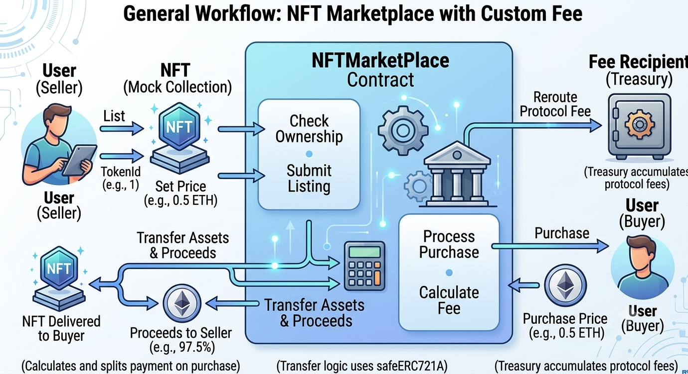

<div align="center">
  <h1>🖼️ NFT Marketplace & ERC721A Mock Collection</h1>
  <p><b>A robust, fee-integrated Web3 NFT marketplace and highly gas-optimized ERC721A token layer.</b></p>
</div>

## 📖 About the Project

The **NFT Marketplace & ERC721A Mock Collection** is a production-ready Web3 Smart Contract ecosystem built with **Solidity `0.8.30`** and engineered using the **Foundry** framework. At its core, the project provides a highly secure secondary market for trading NFTs, paired with a versatile, gas-optimized ERC721A contract for initial token distribution.

This architecture is ideal for decentralized marketplaces, Web3 gaming economies, or creators launching custom collections. It emphasizes security, gas efficiency, and protocol monetization through a configurable basis-point fee system.

**Key Technical Highlights:**
* **Solidity `0.8.30`:** Leveraging up-to-date compiler features for absolute security and optimization.
* **ERC721A Implementation:** Utilizes the industry-leading Azuki ERC721A standard for highly gas-efficient batch minting.
* **Soulbound Capabilities:** Supports immutable, non-transferable token configurations (Soulbound Tokens) enforced at the contract level.
* **OpenZeppelin Contracts:** Implements standard `Ownable` and `ReentrancyGuard` to defend against common attack vectors.
* **Foundry Framework:** Complete with high-speed fuzz testing, state assertions, and detailed coverage reports.

---

## ⚙️ How It Works

The ecosystem is divided into two primary components: the `NFTMock` (ERC721A) collection and the `NFTMarketPlace`. 

Users can mint tokens directly from the `NFTMock` contract, which enforces rules like max supply, maximum mints per wallet, and native ETH pricing. Once minted, users can approve and list their NFTs on the `NFTMarketPlace`. When a buyer executes a purchase, the marketplace atomically calculates a predefined basis-point fee (e.g., 2.5%), routes the fee to a designated treasury address, and sends the remaining funds directly to the seller. 

### Architecture Diagram

 *(Note: Add your custom architectural diagram here)*

[NFTMarketPlace.sol](./src/NFTMarketPlace.sol) - Main Marketplace Logic

[NFTMock.sol](./src/NFTMock.sol) - Gas-Optimized ERC721A Token Contract

---

## 💻 Technical Docs

The primary interaction points handle NFT minting, secondary market listing, and atomic purchasing. State changes are strictly guarded against reentrancy and unauthorized access.

### mint (NFTMock.sol)
Allows users to mint NFTs while strictly enforcing wallet limits, global max supply, and exact native ETH pricing.

```solidity
    function mint(uint256 _quantity) external payable nonReentrant {
        uint256 maxamountPerWallet = getMaxAmountToPurchasePerWallet();
        if (totalSupply() + _quantity > getMaxSupply()) revert NFTMock__SoldOut();
        if (_quantity > maxamountPerWallet) revert NFTMock__CannotPurchaseThatAmount();
        if (balanceOf(msg.sender) + _quantity > maxamountPerWallet) revert NFTMock__MaxAmountReachedOrInvalidPerWallet();
        if (msg.value != getNftPrice() * _quantity) revert NFTMock__IncorrectPrice();
        
        _safeMint(msg.sender, _quantity);
    }
```

### listNFT (NFTMarketPlace.sol)
Allows token owners to list their approved NFTs on the marketplace for a designated price.

```Solidity
    function listNFT(address _nftAddress, uint256 _tokenId, uint256 _price) external nonReentrant {
        if (_price == 0) revert NFTMarketPlace__PriceCannotBeZero();
        if (IERC721A(_nftAddress).ownerOf(_tokenId) != msg.sender) revert NFTMarketPlace__YouDontOwnTheToken();

        Listing memory _listing = Listing({
            seller: msg.sender,
            nftAddress: _nftAddress,
            tokenId: _tokenId,
            price: _price
        });
        s_listing[_nftAddress][_tokenId] = _listing;

        emit NFTListed(msg.sender, _nftAddress, _tokenId, _price);
    }
```

### buyNFT (NFTMarketPlace.sol)
Executes the purchase of a listed NFT. Atomically deducts the protocol fee, transfers the asset, and distributes proceeds to the seller.

```Solidity
    function buyNFT(address _nftAddress, uint256 _tokenId) external payable nonReentrant {
        Listing memory listing = s_listing[_nftAddress][_tokenId];
        if (listing.price == 0) revert NFTMarketPlace__NFTNotListed();
        if (msg.value != listing.price) revert NFTMarketPlace__IncorrectPrice();

        delete s_listing[_nftAddress][_tokenId];

        IERC721A(_nftAddress).safeTransferFrom(listing.seller, msg.sender, listing.tokenId);
        uint256 feeAmount = (listing.price * getFeeBasisPoints()) / uint256(PERCENTAGE_BASIS);
        uint256 sellerProceeds = listing.price - feeAmount;

        if (feeAmount > 0) {
            (bool feeSuccess, ) = getFeeRecipient().call{value: feeAmount}("");
            if (!feeSuccess) revert NFTMarketPlace__TransferFailed();
        }

        (bool sellerSuccess, ) = listing.seller.call{value: sellerProceeds}("");
        if (!sellerSuccess) revert NFTMarketPlace__TransferFailed();

        emit NFTSold(msg.sender, listing.seller, listing.nftAddress, listing.tokenId, listing.price);
    }
```

🚀 Execution Example
Here is a step-by-step example of how users interact with the ecosystem to mint, list, and trade an NFT.

- Step 1: Setup & Deploy
The protocol owner deploys the NFTMarketPlace and NFTMock contracts. The marketplace is initialized with a standard 2.5% fee (25 basis points on a 1000 scale). The NFTMock is initialized with a set price (e.g., 0.5 ETH), a max supply, and the soulbound parameter set to false.

- Step 2: Minting the Asset
User A wants to join the ecosystem. They call the mint(1) function on the NFTMock contract, attaching 0.5 ETH. The ERC721A contract efficiently mints Token ID #1 to User A's wallet.

- Step 3: Approving the Marketplace
To sell the NFT, User A must grant the marketplace permission to handle the token. User A calls approve(MARKETPLACE_ADDRESS, 1) on the NFTMock contract.

- Step 4: Listing the NFT
User A calls listNFT(NFT_ADDRESS, 1, 1 ether) on the NFTMarketPlace. A listing is created in the contract's mapping, and an NFTListed event is broadcasted on-chain.

- Step 5: Executing the Trade
User B decides to buy the NFT. They call buyNFT(NFT_ADDRESS, 1) on the marketplace, attaching exactly 1 ETH.

- Step 6: Under the Hood Distribution
The marketplace pulls the 1 ETH. It calculates a 2.5% protocol fee (0.025 ETH) and sends it to the protocol owner's treasury. It sends the remaining 0.975 ETH to User A. Finally, it safely transfers Token ID #1 from User A to User B, clearing the active listing.

⬆️ Installation
Ensure you have Foundry installed on your machine. Install the required project dependencies (OpenZeppelin Contracts and ERC721A) using the command below:
```Bash
forge install OpenZeppelin/openzeppelin-contracts chiru-labs/ERC721A foundry-rs/forge-std
```

🧪 Testing
```Bash
forge test -vvvv
```

📊 Coverage
```Bash
forge coverage
```

📜 Contract Addresses
(Provide deployed mainnet/testnet contract addresses here)

- NFTMarketPlace: [Deploy and paste your contract address here]

- NFTMock Collection: [Deploy and paste your contract address here]